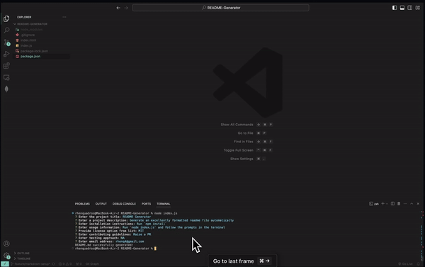

## Deliverable

## Deliverable

Github - https://github.com/rhen-quadros/README-Generator

# README Generator

## Description

Generate an excellently formatted readme file automatically

## Table of Contents

- [Installation](#installation)
- [Usage](#usage)
- [License](#license)
- [Contributing](#contributing)
- [Tests](#tests)
- [Questions](#questions)

## Installation

Run `npm install`

## Usage

Run `node index.js` and follow the prompts on the terminal

## License

This project is covered under the MIT License

## Contributing

Raise a PR

## Tests

NA

## Questions

Reach out for additional questions at: rhenq4@gmail.com
